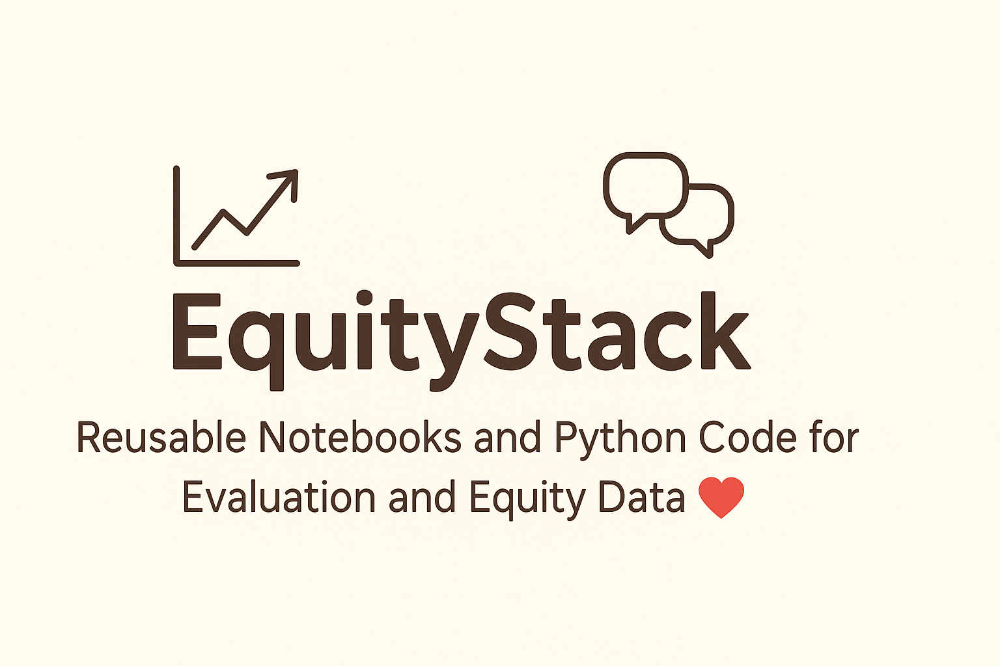

# EquityStack 📊

**EquityStack** is a Python-based, modular, and field-aware toolkit of reusable notebooks, functions, and pipelines for applied data work — especially in public health, gender, climate, education, and evaluation sectors.

It helps analysts, MEL professionals, and researchers turn raw data into clean, interpretable outputs — fast.

---

## 🗺️ Folder Map

```
EquityStack/
├── notebooks/            # Jupyter notebooks with examples
├── social_sector/        # Domain-specific helpers
├── cleaning/             # Wrangling, tidying, validations
├── visualisation/        # Custom plots, maps
├── modelling/            # Predictive/statistical models
├── io_helpers/           # File input/output tools
├── validation/           # Column checks, schema tests
├── tests/                # pytest tests for key modules
├── sample_data/          # Simulated or cleaned inputs
├── README.md
├── ROADMAP.md
├── LICENSE
├── requirements.txt
├── CONTRIBUTING.md
```

---

## 📘 What's Inside

- Modular Python scripts (`.py`) and testable functions
- Jupyter notebooks with sample CSV data
- Spatial plotting (e.g., health access index maps)
- Survey analysis, education summaries, WEE examples
- Dashboard prep: wide → long + clean exports
- Compatible with pandas, geopandas, folium, matplotlib, numpy

---
# Generate CITATION.cff file for GitHub citation tab (for EquityStack or FieldStack)

citation_cff = """
cff-version: 1.2.0
message: "If you use this repository, please cite it using the metadata below."
title: "EquityStack: Reusable Tools for Applied Data Analysis and Evaluation"
authors:
  - family-names: "Sri Raman"
    given-names: "Varna"
    orcid: "https://orcid.org/0000-0002-XXXX-XXXX"
date-released: 2024-04-18
version: "1.0.0"
url: "https://github.com/Varnasr/EquityStack"
repository-code: "https://github.com/Varnasr/EquityStack"
license: "MIT"
type: "software"
"""

citation_path = "/mnt/data/CITATION.cff"
with open(citation_path, "w") as f:
    f.write(citation_cff)

citation_path


## 🧭 Roadmap Snapshot

> ✅ v1.0: Clean modular structure, tests, spatial & social sector tools  
> 🚀 v1.1+: Dashboards, NLP, real datasets, multi-language support

See [ROADMAP.md](./ROADMAP.md) for details.

---

## 📬 Contact

- Email: varna[DOT]sr [AT] gmail [DOT] com  
- Website: [varnasr.github.io](https://varnasr.github.io)  
- LinkedIn: [Varna Sri Raman](https://www.linkedin.com/in/varna)

---

You're welcome to fork, adapt, and use — EquityStack is a living repository for better, fairer data workflows.

If you use this repository in your work, please cite it as:
Sri Raman, V. (2025). *[EquityStack/FieldStack]: Reusable Tools for Applied Data Analysis and Evaluation*. GitHub. https://github.com/Varnasr/EquityStack

